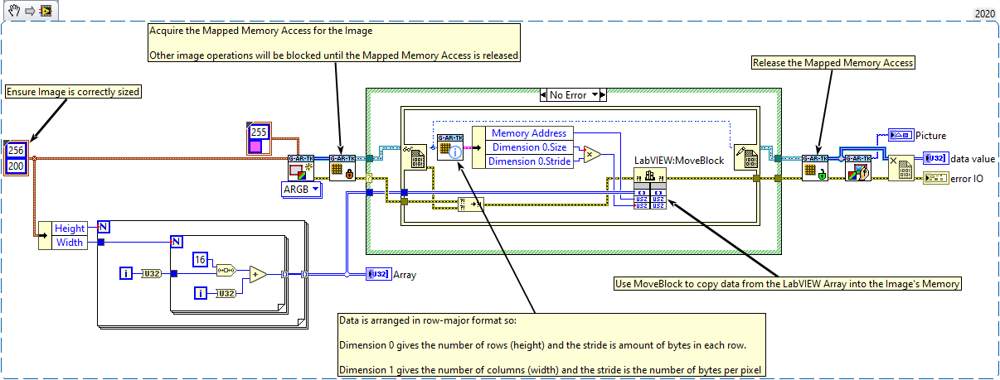

## Mapped Memory Access
Mapped Memory Access allows for direct access to a G-ARTK image's data. This can be used to get the memory address of the data and the memory layouts information.

This means it can be use in the snippet below with a function which takes a pointer such as the LabVIEW Memory Manager function [MoveBlock](https://www.ni.com/docs/en-US/bundle/labview-api-ref/page/properties-and-methods/lv-manager/moveblock.html)

## IMAQ Interoperability
Whilst this toolkit is designed to have no IMAQ or NI-Vision dependencies, users may wish to integrate it alongside IMAQ/NI-Vision functionality.

Methods of copying to/from IMAQ images into the g-ar-tookit image format can be accomplished using the snippets below:

> ![NOTE]
> Only basic IMAQ functions are required when using the `Get Pixel Ptr` IMAQ vi. Other operations using the IMAQ to Array functions require NI-Vision

## Python Interoperability
Two utility VIs are provided to convert between 2D U32 ARGB image arrays and 3D pixel-byte arrays which are compatible with opencv-python image data

