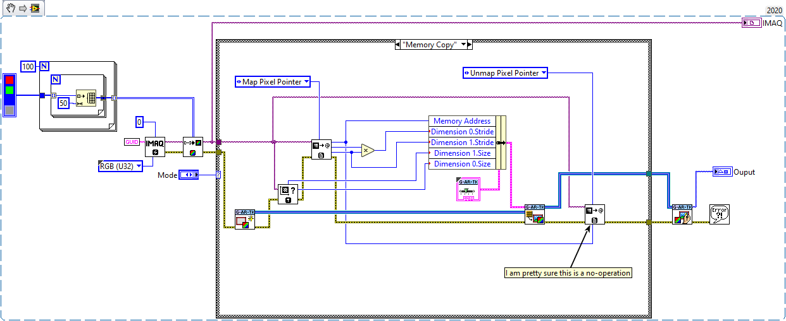
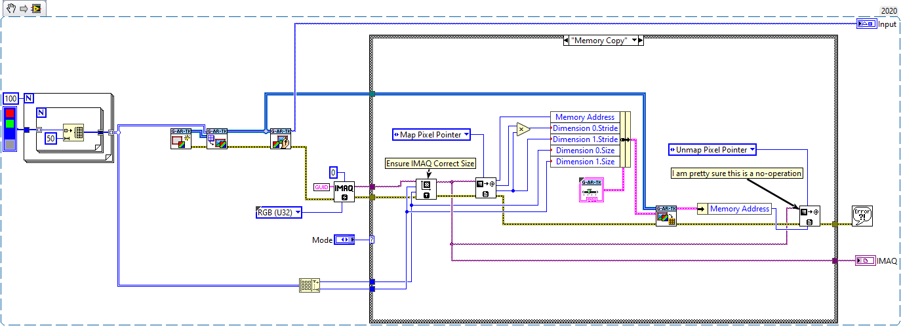
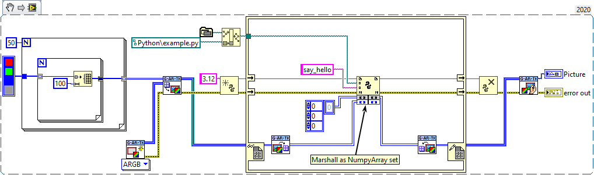

## IMAQ Interoperability
Whilst this toolkit is designed to have no IMAQ or NI-Vision dependencies, users may wish to integrate it alongside IMAQ/NI-Vision functionality.

Methods of copying to/from IMAQ images into the g-ar-tookit image format can be accomplished using the snippets below:

> ![NOTE]
> Only basic IMAQ functions are required when using the `Get Pixel Ptr` IMAQ vi. Other operations using the IMAQ to Array functions require NI-Vision

## Python Interoperability
Two utility VIs are provided to convert between 2D U32 ARGB image arrays and 3D pixel-byte arrays which are compatible with  opencv-python image data

